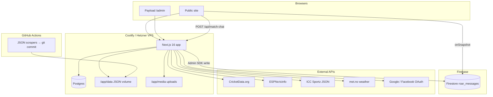
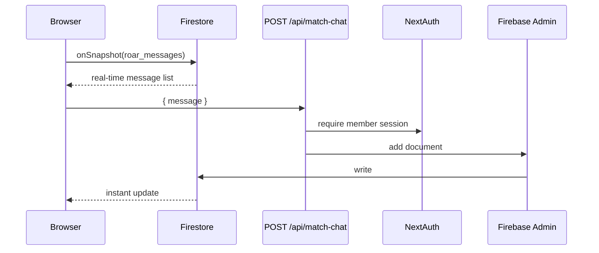

# Architecture

How The Tigers' Den is put together — runtime, data stores, and external providers.

## High-level overview

---

## Runtime stack

| Layer | Technology |
|-------|------------|
| Framework | Next.js 16 (App Router) |
| CMS | Payload 3 (Lexical rich text, Sharp images) |
| Styling | Tailwind CSS 4 |
| Member auth | NextAuth v5 (Google + Facebook) |
| Admin auth | Payload Users collection |
| Live chat | Firebase Firestore (`onSnapshot` + Admin SDK writes) |
| Node | 20.x (see `package.json` engines) |

---

## Data stores

We split data by access pattern — relational CMS/social in Postgres, hot JSON caches on disk, chat in Firestore.

| Store | Used for | Local dev | Production |
|-------|----------|-----------|------------|
| **Postgres** | Members, posts, stand, player registry, cricket snapshots (tours/rankings pages), CMS | Optional | **Yes** — Coolify Postgres on same server (`POSTGRES_URL`) |
| **SQLite** | Same as Postgres when no `POSTGRES_URL` | **Yes** (`DATABASE_URI=file:./tigersden.db`) | Legacy only — not recommended |
| **JSON files** (`data/*.json`) | ICC rankings, WTC, Bangladesh last match, news backup, ESPN squads, **tour detail snapshots**, **venue guides**, fixture times | Repo + local reads | `/app/data` persistent volume |
| **Firestore** | The Roar live chat messages only | Optional (needs Firebase env) | **Yes** — `roar_messages` collection |
| **Media volume** | CMS uploads (hero, post images) | `./media` | `/app/media` persistent volume |

### Why three stores?

- **Postgres** — Payload needs SQL for CMS, members, and pre-built cricket page snapshots. Co-located on Hetzner avoids Neon latency and quota.
- **JSON volume** — Large, read-mostly cricket caches (ICC feed, news scrape). GitHub Actions commit updates; deploy seeds missing files into the volume.
- **Firestore** — Sub-second chat sync for hundreds of fans during a live match. Postgres polling was too slow (20s); chat does not belong in the CMS DB.

Migrating off Neon: [migrate-neon-to-server-postgres.md](./migrate-neon-to-server-postgres.md).

---

## Cricket data pipeline

### Live (request-time)

| Feature | Primary source | Fallback / cache |
|---------|----------------|------------------|
| Live scores & marquee | ESPN live API | Cached snapshot |
| Match centre scorecard | ESPN match centre | — |
| Upcoming marquee | ESPN fixtures + curated JSON | Cached snapshot |
| Venue weather + 6h forecast | met.no (via geocoding) | — |
| Bangladesh last result | ESPN live API | `data/bangladesh-last-match.json` |
| Headlines (home) | ESPN RSS + Cricbuzz scrape | `data/bangladesh-cricket-news.json` |

### Pre-built (nightly cron → Postgres `cricket-snapshots` + JSON volume)

| Page / data | Built by | Stored in | Read by |
|-------------|----------|-----------|---------|
| `/tours` index | `syncCricketSnapshots` | `tours-index` snapshot | `lib/cricket/services/tours.ts` |
| `/tours/[slug]` | `buildTourDetailLive` per series | `tour-detail:{slug}` + `data/tour-details.json` | `lib/cricket/services/tour-detail.ts` |
| Venue & city guides | `resolveTourVenues` during sync | `venue-guides` + `data/venue-guides.json` | Embedded in each tour snapshot |
| `/rankings` showcase | rankings showcase snapshot | `rankings-showcase` | `lib/cricket/services/rankings-display.ts` |

Tour detail pages are **never** built at request time. The sync job fetches ESPN season events (fixtures, results, venues), resolves venue copy once per ground, and writes snapshots. Finished series are pruned when they leave the upcoming tours index.

CricAPI is skipped if the tours snapshot is **&lt; ~24h** old (unless `?force=1`). On quota failure, previous snapshots are kept and ESPN schedules fill gaps for both the index and tour detail builds.

ICC rankings on the rankings page use the **Sportz JSON feed** (same data as icc-cricket.com) with per-table `rankUpdatedAt` (team, bat, bowl, allrounder).

Details: [cricket-api.md](./cricket-api.md) · Job schedule: [jobs.md](./jobs.md).

---

## The Roar (live chat)

- **Read:** browser → Firestore (public read rules).
- **Write:** browser → API only → Firebase Admin SDK (clients cannot write directly).
- Legacy Payload collections `match-chat-messages` / `match-chat-rooms` are unused.

Setup: [firebase-chat.md](./firebase-chat.md).

---

## Member social (The Stand)

| Entity | Collection | Notes |
|--------|------------|-------|
| Members | `members` | Linked to NextAuth OAuth accounts |
| Posts | `member-posts` | Timeline, profile feed |
| Follows | `member-follows` | Follow graph |
| Stand posts | `posts` (CMS) | Editor announcements |
| Discussions / comments / reactions | `stand-*` | Threaded engagement |

API routes under `/api/social/*` and `/api/stand/*`. Session via `requireMemberSession()`.

---

## Player registry

`players` and `countries` collections back ranking player cards and profile URLs. Seeded and repaired during nightly cricket sync (`ensureCountriesSeeded`, `repairInvalidPlayerProfiles`).

---

## API routes (summary)

| Prefix | Purpose |
|--------|---------|
| `/api/cricket/*` | Live scores, tours, rankings, scorecard, marquee |
| `/api/match-chat` | Post to The Roar (GET still available for debugging) |
| `/api/social/*` | Posts, feed, follow, profile, avatar |
| `/api/stand/*` | Reactions, comments |
| `/api/cron/cricket` | Nightly cricket sync (Bearer `CRON_SECRET`) |
| `/api/admin/bootstrap-db` | Migrations + optional cricket seed on deploy |
| `/api/auth/*` | NextAuth handlers |

---

## Deploy lifecycle

On each Coolify deploy, `deploy/docker-entrypoint.sh`:

1. Seeds missing `data/*.json` from image into `/app/data` volume.
2. Ensures `/app/media` exists.
3. When `CRON_SECRET` is set, waits for the app then calls `POST /api/admin/bootstrap-db` (migrations + stale cricket sync if needed).

See [deploy-coolify.md](./deploy-coolify.md) and [jobs.md](./jobs.md).

---

## Security notes

| Surface | Protection |
|---------|------------|
| Cron + bootstrap | `CRON_SECRET` (Bearer token) |
| Member APIs | NextAuth session |
| Payload admin | Payload user login |
| Firestore chat writes | Server-only (rules deny client create) |
| CricAPI keys | `CRICKET_DATA_API_KEY` + optional `CRICKET_DATA_API_KEY_FALLBACK` + `_FALLBACK_2` |
